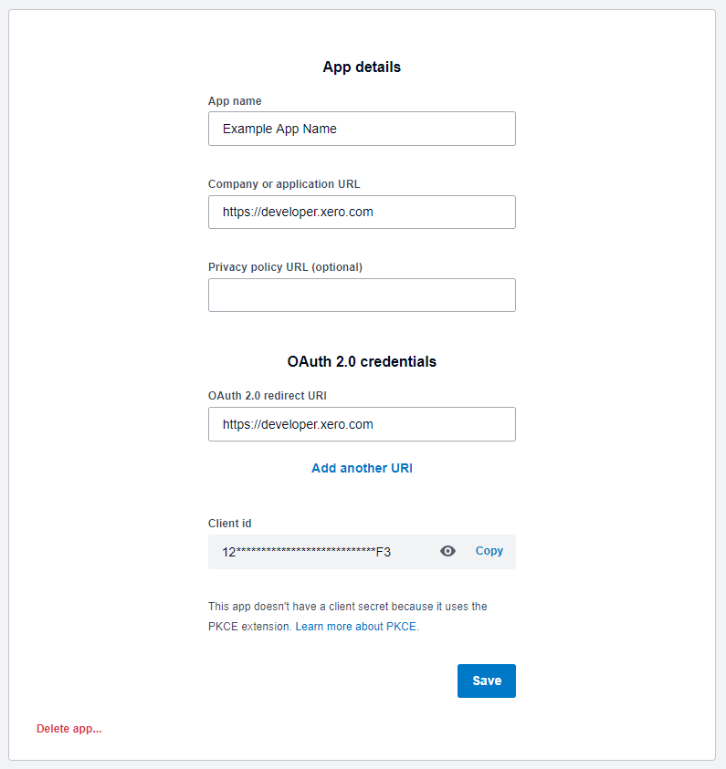
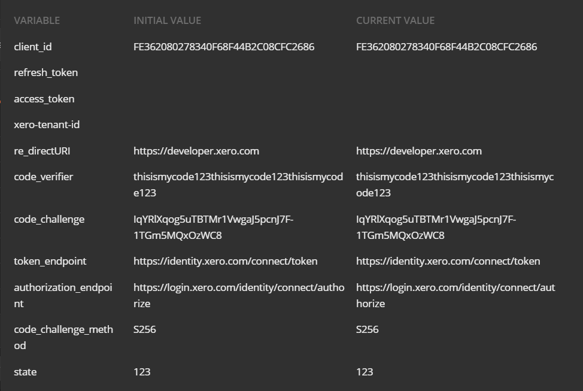
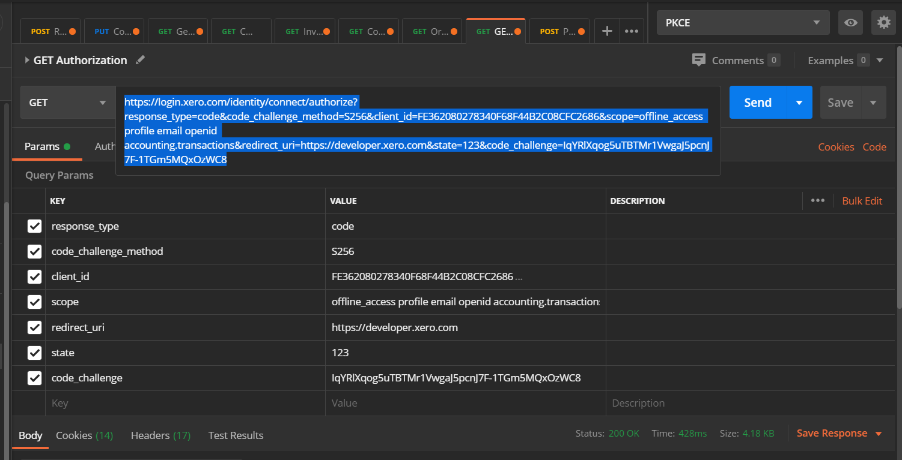
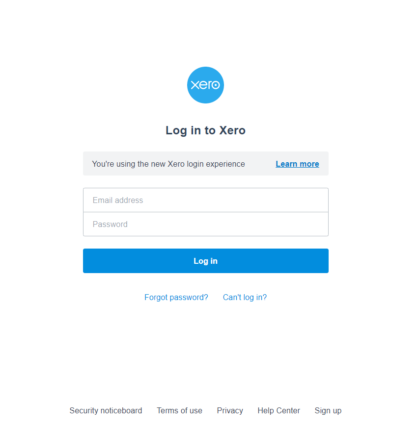
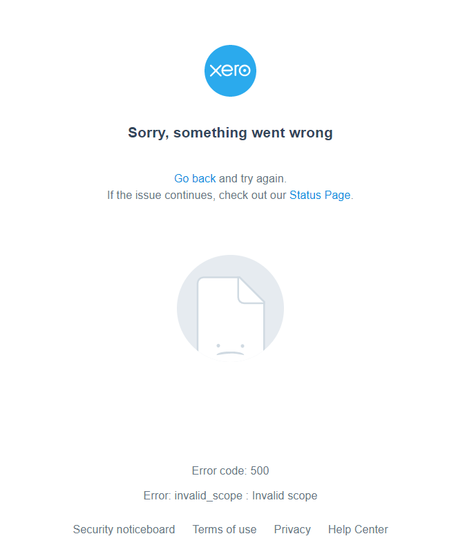
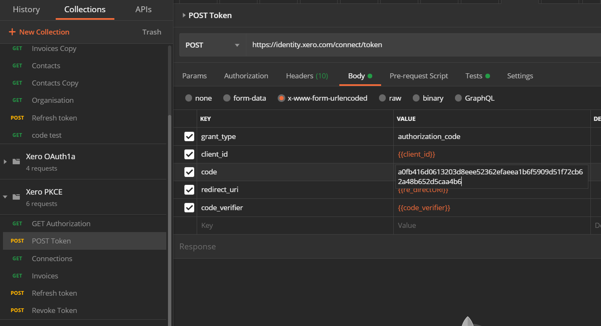
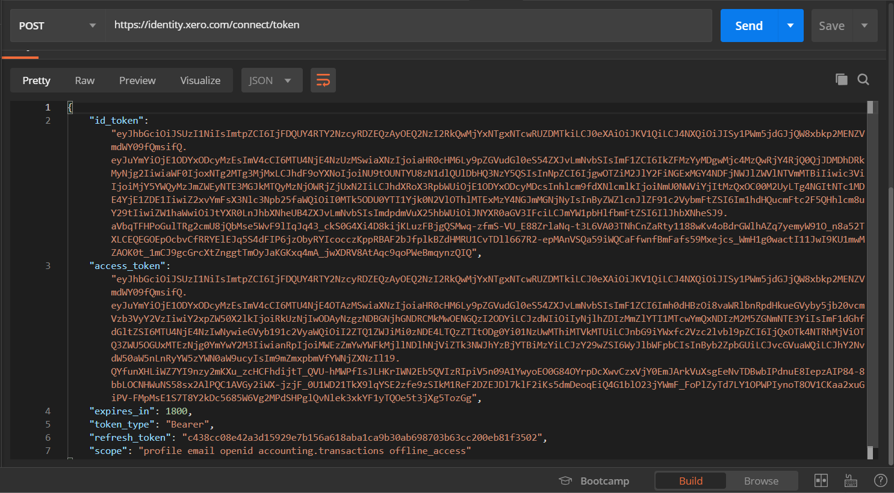
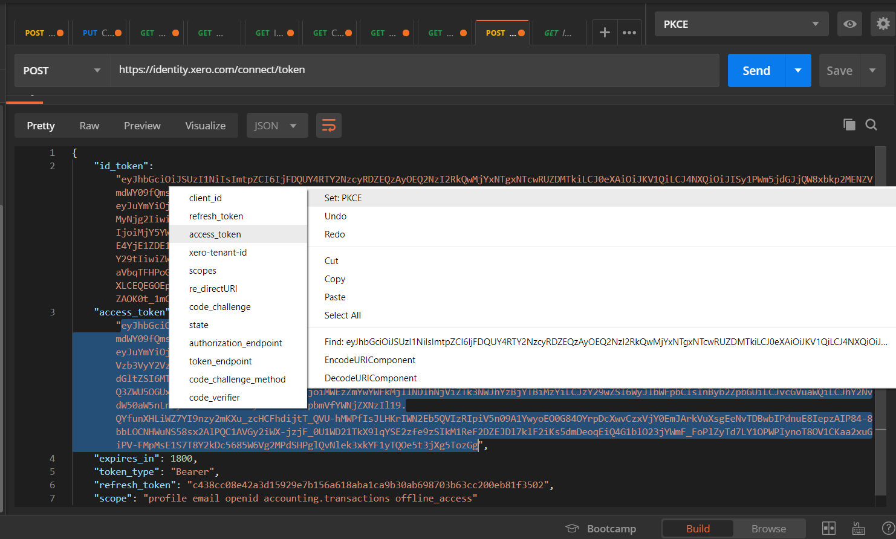

# Xero-Postman OAuth 2.0 via PKCE
A Postman collection for authenticating to the Xero API. 

## Steps to get up and running
Follow these steps to quickly get up and running with the Xero API and Postman with the PKCE Grant Type:

### 1. Import the Xero OAuth 2.0 collection and Xero environment into Postman
Click the button below and select the Desktop version of Postman (Chrome extension doesn't support environment variables). This will also install the Collection and Environment we'll be using.

[](https://app.getpostman.com/run-collection/ba8b27ad64cda3d47caa#?env%5BXero%20OAuth%202.0%20PKCE%20Environment%5D=W3sia2V5IjoiY2xpZW50X2lkIiwidmFsdWUiOiIiLCJlbmFibGVkIjp0cnVlfSx7ImtleSI6InJlZnJlc2hfdG9rZW4iLCJ2YWx1ZSI6IiIsImVuYWJsZWQiOnRydWV9LHsia2V5IjoiYWNjZXNzX3Rva2VuIiwidmFsdWUiOiIiLCJlbmFibGVkIjp0cnVlfSx7ImtleSI6Inhlcm8tdGVuYW50LWlkIiwidmFsdWUiOiIiLCJlbmFibGVkIjp0cnVlfSx7ImtleSI6InJlX2RpcmVjdFVSSSIsInZhbHVlIjoiIiwiZW5hYmxlZCI6dHJ1ZX0seyJrZXkiOiJjb2RlX3ZlcmlmaWVyIiwidmFsdWUiOiIiLCJlbmFibGVkIjp0cnVlfSx7ImtleSI6ImNvZGVfY2hhbGxlbmdlIiwidmFsdWUiOiIiLCJlbmFibGVkIjp0cnVlfSx7ImtleSI6InN0YXRlIiwidmFsdWUiOiIiLCJlbmFibGVkIjp0cnVlfSx7ImtleSI6InRva2VuX2VuZHBvaW50IiwidmFsdWUiOiJodHRwczovL2lkZW50aXR5Lnhlcm8uY29tL2Nvbm5lY3QvdG9rZW4iLCJlbmFibGVkIjp0cnVlfSx7ImtleSI6ImF1dGhvcml6YXRpb25fZW5kcG9pbnQiLCJ2YWx1ZSI6Imh0dHBzOi8vbG9naW4ueGVyby5jb20vaWRlbnRpdHkvY29ubmVjdC9hdXRob3JpemUiLCJlbmFibGVkIjp0cnVlfSx7ImtleSI6ImNvZGVfY2hhbGxlbmdlX21ldGhvZCIsInZhbHVlIjoiUzI1NiIsImVuYWJsZWQiOnRydWV9XQ==)

### 2. Create an OAuth2 app at https://developer.xero.com/myapps
Go to the Xero developer portal and create an OAuth2 app.

If you haven't already signed up for a xero account you can do so [here](https://www.xero.com/signup/api/).

Use the following values:
1. App Name - your choice, but can't contain the word 'Xero'
1. Click ”Auth Code with PKCE”
1. Company or application URL - this needs to be an https address, but isn't used with postman
1. OAuth 2.0 redirect URI - also needs to be https or localhost address 
1. Click Create App

You'll then be taken to your App's Details page. Keep this page open, and start up Postman.

### 3. Add your Variables to the GET Authorisation Call
Copy the following details into the Params tab of the GET Authorisation Call:
1. Response_type - code
2. code_challenge_method - S256
3. Client ID - The Client ID you’ve just generated from the My Apps Page
4. Scopes - the scopes you’ll use to access the areas of Xero you require. More information on Scopes can be found here (https://developer.xero.com/documentation/oauth2/scopes) For this tutorial, we’d suggest using the following:

`openid profile email offline_access accounting.transactions`

5. OAuth 2.0 Redirect URI - The URI you’ve entered into the My Apps Page, this has to match exactly
6. State - any value you wish. Including the State with this call is optional however we suggest using it for this tutorial. If you’re not including State, untick the checkbox next to the State (you’ll also have to untick it on any calls you make)
7. code_challenge - see the step below

### 4. Generate a Code Challenge
The main difference between an Authorisation Grant Type and the PKCE Grant, is that the PKCE Grant does not have Client Secret. It instead uses a Code Verifier and Code Challenge. As you can’t currently generate these codes easily in Postman at the moment, you can use the following online tool to generate them for you: https://tonyxu-io.github.io/pkce-generator/

1. Enter a code verifier into the First Box 
1. This is a random string of ASCII characters between 43 and 128 characters long that can only consist of the characters A-Z, a-z, 0-9, and the punctuation -._~ (hyphen, period, underscore, and tilde).
1. Click “Generate Code Challenge”
1. Copy out the Code Challenge and post it into the Params tab of the GET Authorisation Call from the previous step
1. Keep a hold of the Code Verifier, as you will need this with other calls later

### 5. Add your Variables to the Environment
Just like the Params Tab of GET Authorisation Call, we now need to add the Following Details to your Environment:
1. client_id - The Client ID you’ve just generated from the My Apps Page
1. refesh_token - ignore this field for now, we’ll add this later
1. access_token - ignore this field for now, we’ll add this later
1. xero-tenant-id - ignore this field for now, we’ll add this later
1. Redirect URI - The URI you’ve entered into the My Apps Page, like before this has to match exactly
1. code-verifier - the same Code Verifier used in the last step
1. code-challenge - the same Code Challenge used in the last step
1. token_endpoint - https://identity.xero.com/connect/token
1. authorization_endpoint - https://login.xero.com/identity/connect/authorize
1. code_challenge_method - S256
1. state - the same state as you used in step 3 (if you’ve deselected it in your Authorisation Params, you must deselect it here also)

### 6. Authorise your PKCE App with a Xero Organisation
Now that you have added all the variables to both the Environment and Params Tab, double click and copy the URL that Postman has generated for you out of the URL Call field and paste it into your browser.

You’ll then be directed to the Xero Login Screen. If you hit an Error 500 at this stage, towards the bottom of the error page, an error message will display, showing what is causing the error. Login with a User account with either an active Demo Company, or Xero Organisation (this Organisation can be a Trial).

Good  | Bad
------------- | -------------
  | 

Once logged in you’ll be able to select an Organisation and shown what your app will access within this selected Organisation. If you are happy with this, click Allow Access.

### 7. Receive and Set your Access and Refresh Tokens 

Once you have clicked Allow Access, you’ll be redirected back to the website you’re using as your Redirect URI. In the URL of this website, you’ll be given a code. Copy this Code out of your Browser, from the first character after “code=”, upto the &. Then paste this into the Code field in the Params Tab of the POST Token Call. Add this code to the Code Field.

Once you have added the Code to the POST Token Call, click the Send Button to receive your Access and Refresh Token. You’ll also be given an ID Token if you’ve included the OpenID scopes (openid, profile and email) however we will not be using this Token in this Tutorial. 

Once you’ve received your tokens, Set your Access Token to your Environment:
1. Highlight the Access Token (not including the Quotation Marks)
1. Right Click
1. Set: PKCE (if you have anything other than Set: PKCE, change your environment in the top right corner to the PKCE Environment) 
1. Click access_token

Once this has been done, do the same for the Refresh Token
1. Highlight the Refresh Token (not including the Quotation Marks)
1. Right Click
1. Set: PKCE
1. Click refresh_token

